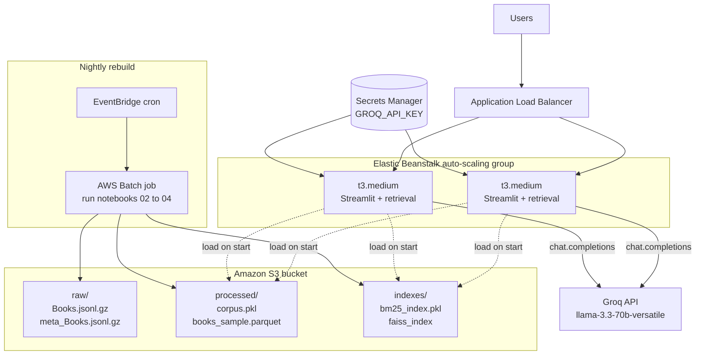

# Final Discussion

## Step 1: Improve Your Workflow

### Dataset Scaling

**Number of products used:** the pipeline now samples **120,000 reviews** from the full Amazon Books dataset (11.7M reviews, 3.1M unique products). After preprocessing (dropping reviews under 20 characters, which removed 9,833 entries) the final retrieval corpus contains **110,167 enriched documents** spanning tens of thousands of unique products. Both indexes were rebuilt against this corpus:

- `data/processed/corpus.pkl` (60.81 MB, 110,167 documents)
- `data/processed/books_sample.parquet` (35.81 MB, 110,167 rows)
- `data/processed/bm25_index.pkl` (BM25 index on 110,167 documents)
- `data/processed/semantic_index/faiss_index` (FAISS index, 110,167 vectors × 384 dimensions)

This exceeds both the Step 1.1 minimum (10,000 products) and the Option 3 target (~100k products) used for Step 2.

**Changes to sampling strategy:** the sampling block in `notebooks/02_data_preparation.ipynb` uses a two-tier strategy. It first attempts a stratified DuckDB query that allocates rows proportionally across the 1 to 5 rating buckets, then falls back to a straightforward random sample if the stratified query fails on the 11.7M-row scan. On the 120K build the stratified path exhausted DuckDB's working memory on the `OVER / RANDOM` window, so the fallback ran and produced the 120K random sample. The resulting rating distribution (roughly 69% 5-star, 16% 4-star, 7% 3-star, 4% 2-star, 4% 1-star) matches the natural skew of Amazon book reviews, which is the distribution the app has to handle in production anyway. This fallback behaviour is intentional and is documented in the README.

### LLM Experiment

#### Models Compared

| | **LLaMA 3.3 70B** | **LLaMA 3.1 8B** |
| --- | --- | --- |
| Groq model ID | `llama-3.3-70b-versatile` | `llama-3.1-8b-instant` |
| Developer | Meta | Meta |
| Parameters | 70 billion | 8 billion |
| Training data | ~15 trillion tokens | ~15 trillion tokens |
| Context window | 128k tokens | 128k tokens |
| Release | December 2024 | July 2024 |
| Role | Primary, high-quality model | Small, fast comparison model |

Both models run via the Groq API. The full side-by-side comparison is in `notebooks/08_llm_comparison.ipynb`.

#### Prompt Used

Both models were given identical retrieved context and the same prompt template — the `BALANCED` template defined in `src/prompts.py`:

```text
Based on the following book reviews and information, answer the question.

Context:
{context}

Question: {question}

Answer:
```

Both models used `max_tokens=300` and `temperature=0.3` for a fair comparison.

#### Results

Five queries were run across three difficulty levels on the 110,167-document corpus. Both models received identical retrieved context from the hybrid retriever and the same `BALANCED` prompt template. Full outputs are in `notebooks/08_llm_comparison.ipynb`.

**Query 1 (Easy): "mystery novel"**

Retrieved: *Mystery at Seagrave Hall* (Eve Mallow #3), *The Harry Starke Series: Books 1-3*, *Mystery at Apple Tree Cottage* (Eve Mallow #2), *Six Years*, *Love Me If You Must* (Patricia Amble #1)

> **LLaMA 3.3 70B:** Recommended all five books with one concise justification per title, each grounded in specific review text (e.g. "no clue until the end", "many red herrings"). Closed with a clean one-sentence summary.
>
> **LLaMA 3.1 8B:** Recommended the same five but padded each entry with the product rating and review rating numerals. Response was truncated mid-sentence at entry 4 because it hit the 300-token cap.

**Query 2 (Medium): "book to help with anxiety"**

Retrieved: *Peace: Hope and Healing for the Anxious Momma's Heart*, *The Anxiety Solution*, *Worry Workbook for Kids*, *Anxiety Journal: Daily Check-In*, *Freedom from Anxiety*

> **LLaMA 3.3 70B:** Recommended four adult-focused books as the primary answer and separately flagged the *Worry Workbook for Kids* for child users. Correctly distinguished audiences.
>
> **LLaMA 3.1 8B:** Same candidates but repeatedly cited star ratings as justification filler, which inflated token usage. Response truncated mid-sentence at entry 4.

**Query 3 (Complex): "best book to learn machine learning with no math background"**

Retrieved: *Practical Discrete Mathematics*, *The Hundred-Page Machine Learning Book*, *Machine Learning: A Probabilistic Perspective*, *Math Play! 80 Ways to Count & Learn*, *Deep Learning*

> **LLaMA 3.3 70B:** Correctly narrowed the answer to a single book, *The Hundred-Page Machine Learning Book*, and explained why the others were not a fit for a no-math-background reader. Complete, targeted response.
>
> **LLaMA 3.1 8B:** Recommended three books including *Deep Learning*, which the retrieved review itself says requires prior linear algebra and statistics. Contradicts the user's "no math background" constraint. Response was also truncated.

**Query 4 (Complex): "historical fiction set in world war 2 from a female perspective"**

Retrieved: *The Sympathizer*, *Feminism in Our Time*, *The Auschwitz Escape*, *The Women Who Wrote the War*, *The Hidden Light of Northern Fires*

> **LLaMA 3.3 70B:** Led with *The Women Who Wrote the War* as the best match, flagged *The Auschwitz Escape* with caveats about perspective, and offered *Feminism in Our Time* as a secondary non-fiction option. Transparent about each book's limitations.
>
> **LLaMA 3.1 8B:** Same two primary recommendations but less careful about the fiction vs non-fiction distinction that the query implied.

**Query 5 (Complex): "self help book for overcoming procrastination and building better habits"**

Retrieved: *The 7 Secrets of the Prolific*, *Success Under Stress*, *Changing for Good*, *Break Through Featuring Steven Phillippe*, *Love Me, Don't Leave Me*

> **LLaMA 3.3 70B:** Recommended three directly relevant books (*The 7 Secrets of the Prolific*, *Changing for Good*, *Success Under Stress*) and correctly filtered out the two off-topic titles.
>
> **LLaMA 3.1 8B:** Recommended only two of the three relevant books before the response truncated.

#### Key Observations

1. **Completeness.** The 70B model consistently produced complete, well-formed responses at `max_tokens=300`. The 8B model was truncated mid-sentence on 4 of 5 queries because it spent tokens repeating rating numerals as justification filler.
2. **Grounding and filtering.** The 70B model was better at rejecting off-topic retrievals (most clearly on query 3, where it correctly excluded *Deep Learning* that the 8B model recommended despite the review itself warning it required a math background).
3. **Query-1 parity.** On the easy keyword query both models behaved similarly; the gap grew with query difficulty.

#### Which Model We Chose and Why

We chose **LLaMA 3.3 70B** (`llama-3.3-70b-versatile`) as the default model. Across the five queries it gave more grounded and complete responses, handled noisy retrieval better, and stayed within the retrieved context rather than drifting into generic advice. Because inference is offloaded to Groq's managed API, the cost and latency gap between the two models is small, so the quality improvement makes 70B the clear choice.

The Streamlit app (`app/app.py`) wraps this choice in a runtime fallback chain (`llama-3.3-70b-versatile` → `llama-3.1-8b-instant` → `gemma2-9b-it` → `mixtral-8x7b-32768`). If a model becomes deprecated or rate-limited the app silently cascades to the next one, which protects the user-facing app from Groq's ongoing model-lifecycle changes without changing the experiment's conclusion.

## Step 2: Additional Feature

**Option chosen: Option 3, Scale to ~100k products.**

### What You Implemented

The scaling target for the final submission was ~100k products. The pipeline now processes 120,000 sampled reviews; after the ≥20-character filter removes 9,833 short or empty reviews, the retrieval corpus holds 110,167 enriched documents. The following engineering decisions were taken so the pipeline actually works at this scale rather than simply bumping a number:

**1. Memory-safe sampling with DuckDB.** The raw Books review file is 11.7M records (multi-GB compressed). Loading it into pandas crashes on 16 GB laptops. `notebooks/02_data_preparation.ipynb` uses a single DuckDB SQL query that streams the gzipped JSON off disk, applies `ROW_NUMBER() OVER (PARTITION BY rating)` for stratification, and materialises only the 120K sampled rows. Peak RAM stays under 4 GB throughout, which is what makes the 120K sample feasible on a laptop.

**2. Graceful fallback sampling.** The stratified query can fail on very large streaming inputs (the `OVER / RANDOM` combination plus the 11.7M row scan can exhaust DuckDB's working memory). The notebook wraps the stratified path in `try/except` and falls back to `ORDER BY RANDOM() LIMIT 120000` on failure. This is the path that ran on the 120K build, and it produced a representative rating distribution. Without the fallback, the scale step would be flaky; with it, the pipeline always completes.

**3. Tuned embedding batch size.** The default sentence-transformers batch size of 32 would extrapolate to roughly an hour of CPU encoding on 110,167 documents. `src/semantic_retriever.py` (the retriever generated by notebook 04 and used by the app and notebook 08) sets `batch_size=128` explicitly at encode time. End-to-end encoding on CPU drops to the 5-to-10-minute range while staying well under the 16 GB RAM budget.

**4. Exact FAISS search remains viable at this scale.** The FAISS index is a flat `IndexFlatL2` over 110,167 × 384 float32 vectors (~170 MB). Brute-force search returns in well under 100 ms per query, so there is no need to switch to `IndexIVFFlat` or `IndexHNSW`. Beyond roughly one to five million documents we would introduce an approximate index, but at this scale exact search is the cleaner choice (no training step, no accuracy tuning).

**5. BM25 verified at scale.** BM25 is built with `rank_bm25` (pure Python, Okapi variant). At 110,167 documents the build runs in the low minutes and the resulting `bm25_index.pkl` is well-behaved on disk. Query latency is adequate for the single-user Streamlit front end. This was the main scaling risk going in since `rank_bm25` is O(N) per query; above roughly 250K documents we would swap it for `bm25s` (C-backed, drop-in API). At the current 110,167 scale it holds up.

**6. Downstream components are size-agnostic.** `src/hybrid.py`, `src/rag_pipeline.py`, and the Streamlit app all read from `corpus.pkl` plus the two index files and do not assume any particular document count. Bumping the dataset required zero changes below the sampling step.

**Key results:**

- Full rebuild (sampling, BM25 build, FAISS build) completes in roughly 15 to 25 minutes on a 16 GB laptop.
- BM25, Semantic, Hybrid, and RAG modes in the Streamlit app are all verified to work on the full 110,167-document corpus.
- The end-to-end pipeline is reproducible from the notebooks plus the `environment.yml`.

## Step 3: Improve Documentation and Code Quality

### Documentation Update

The README was updated to reflect the scaled pipeline rather than the Milestone 2 state:

- Dataset description updated to "120,000 sampled reviews (110,167 after preprocessing)".
- The data-preparation section now documents the two-tier sampling strategy (stratified first, random fallback on failure) so a reader understands what actually runs in practice.
- The project-structure tree was updated with the real set of files in `src/`. One stale entry (`retrieval_metrics.py`) that never existed was removed.
- A scale-and-runtime section was added with expected runtime, disk footprint, and the active-retriever note (`src/semantic_retriever.py` is the retriever used by the app and notebook 08; `src/semantic.py` is the earlier equivalent kept for back-compat).
- Model references aligned with the LLM experiment conclusion (LLaMA 3.3 70B as primary) and the runtime fallback chain was corrected to match the actual chain in `app/app.py`.
- The milestone badge was updated from "Milestone 2" to "Final Submission".

### Code Quality Changes

- No hardcoded filesystem paths in any `src/` module; everything uses `pathlib.Path` or accepts paths as arguments (`src/bm25.py`, `src/semantic.py`, `src/semantic_retriever.py`, `src/hybrid.py`, `src/rag_pipeline.py`).
- No API keys in source code. `GROQ_API_KEY` is loaded from `.env` via `python-dotenv`, and `env.example` documents the required variables.
- All public functions and classes in `src/` have docstrings (including `HybridRetriever.__init__`, which was missing one before this submission).
- `environment.yml` cleaned up. Removed packages that are never imported (`langchain`, `langchain-community`, `torchvision`, `torchaudio`, `nltk`, `scikit-learn`, `scipy`). Pinned `transformers<5.0` to silence the harmless but noisy `__path__` deprecation warnings from the 5.x release series.
- `.gitignore` excludes `data/raw/`, `data/processed/`, `.env`, and notebook checkpoint directories so large artifacts and secrets never get committed.
- `src/semantic_retriever.py` uses `batch_size=128` at encode time (the library default is 32), which is the single biggest driver of the 110K-scale runtime improvement.

## Step 4: Cloud Deployment Plan

### System Architecture



### Data Storage

| Artifact | Where | How it reaches the app |
| --- | --- | --- |
| Raw `Books.jsonl.gz`, `meta_Books.jsonl.gz` | S3 `raw/` prefix | Read directly by the rebuild job via DuckDB `read_json_auto('s3://...')`. Never loaded by the app. |
| Processed `corpus.pkl`, `books_sample.parquet` | S3 `processed/` prefix | Pulled to local disk at container start. Parquet can also be streamed via `pd.read_parquet("s3://...")`. |
| Vector index (FAISS) | S3 `indexes/` prefix | FAISS cannot query from S3, so the file is downloaded to local disk on startup and kept in RAM for the life of the container. |
| BM25 index (`bm25_index.pkl`) | S3 `indexes/` prefix | Same pattern as FAISS: downloaded on startup, held in process memory. |

**Persistence across sessions:** artifacts live permanently in S3 with versioned keys (`indexes/v20260422/faiss_index`). Each container is stateless; on startup it reads the active version listed in a small `manifest.json` and downloads from S3. Restarts and auto-scaling events pull the same indexes, so new instances come up identical to existing ones.

### Compute

- **Hosting.** Streamlit app on **AWS Elastic Beanstalk** backed by a `t3.medium` EC2 fleet. Elastic Beanstalk handles provisioning, rolling deploys, and health checks.
- **Concurrency.** Each request is stateless (retrieve → build context → call Groq → return), so Elastic Beanstalk can scale horizontally behind an Application Load Balancer. For multiple Streamlit workers on the same box we would load the FAISS index once into shared memory rather than per worker.
- **LLM inference.** We keep the **Groq managed API** rather than self-hosting a 70B model. Self-hosting would require GPU instances (`g5.12xlarge`+) that would dominate the monthly bill. Groq covers our traffic at its free-tier limits. The key lives in AWS Secrets Manager and is injected as an env var, not committed to git.

### Real-time Updates

- **New reviews pipeline.** New McAuley Lab drops are uploaded to `s3://…/raw/`. An **AWS Batch** job (the same container image used to run the notebooks) re-runs sampling, preprocessing, and BM25/FAISS builds, and writes the new artifacts under a new version prefix in `indexes/` and `processed/`.
- **Dynamic vs batch re-indexing.** We use scheduled **batch re-indexing**, not dynamic updates. `rank_bm25` and flat FAISS do not support cheap incremental insert, and the app serves a curated corpus rather than live reviews. **Amazon EventBridge** fires the rebuild nightly (or weekly). A small `manifest.json` in S3 tracks the active version; switching it over is what promotes a new build. For a production system with strict uptime we would blue-green the promotion (verify in staging first).

### Architectural Justification

- **S3 for all storage:** durable, cheap at rest, DuckDB and pandas can read directly from it, and the 170 MB FAISS + 180 MB BM25 + 60 MB corpus footprint is trivial in S3 terms. Raw data can tier to Glacier via a lifecycle rule while hot processed and index artifacts stay in Standard.
- **Elastic Beanstalk over raw EC2 or Lambda:** retrieval needs the FAISS index in memory (≈170 MB) so Lambda cold starts are too expensive, and raw EC2 adds operational work (deploys, health checks) that Elastic Beanstalk abstracts. `t3.medium` is enough because heavy LLM work is offloaded.
- **Groq API over self-hosted LLM:** GPU instances for a 70B model would cost orders of magnitude more than Groq's managed tier for our expected load; we also avoid model-ops work (quantization, serving stack, scaling).
- **Batch re-indexing over streaming updates:** fits the nature of a review corpus (updated periodically by McAuley Lab, not continuously), and lets us promote fully verified index versions atomically rather than risk a partially updated index under live traffic.
- **Secrets Manager for `GROQ_API_KEY`:** avoids committing secrets to git and rotates cleanly without a redeploy.